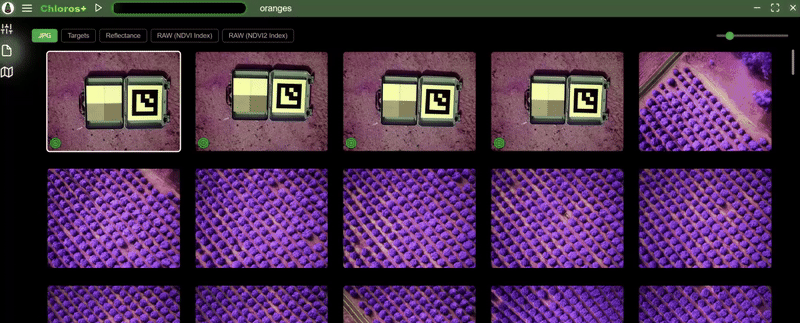

# Pierwsze kroki

<figure><figcaption></figcaption></figure>
Chloros to aplikacja firmy [MAPIR](https://www.mapir.camera) służąca do przetwarzania obrazów i innych danych z czujników.

***

Chloros jest dostępny w 3 trybach działania:

## Chloros: aplikacja GUI na komputery stacjonarne

Samodzielne, oddzielne okno z wszystkimi funkcjami.

## [Chloros CLI: Interfejs wiersza poleceń](CLI.md)

Przetwarzanie wsadowe z poziomu wiersza poleceń. Idealne rozwiązanie do automatyzacji, tworzenia skryptów i zaawansowanych przepływów pracy. _CLI wymaga licencji Chloros+ w celu uzyskania dostępu._

## [Chloros API: Python SDK](api-python-sdk.md)

Programowy interfejs Python do automatyzacji i niestandardowych przepływów pracy. Idealny do procesów badawczych, integracji z istniejącymi aplikacjami Python i tworzenia niestandardowych narzędzi. _API wymaga licencji Chloros+ w celu uzyskania dostępu._

***

## Chloros+

Chociaż Chloros jest bezpłatny w przypadku większości zadań, może się okazać, że potrzebujesz czegoś więcej. W takim przypadku opłacalna może być płatna licencja na Chloros+. Dzięki licencji Chloros+ można odblokować nowe funkcje, takie jak:

* **Przetwarzanie wielowątkowe**: znacznie przyspiesza przetwarzanie obrazów w przypadku większych projektów poprzez jednoczesne przetwarzanie obrazów w ramach potoku.
* **Przyspieszenie GPU (CUDA)**: wykorzystaj dzisiejsze opcje pamięci GPU o większej pojemności, aby jeszcze bardziej przyspieszyć przetwarzanie obrazów. Aby uzyskać najlepsze wyniki, zalecamy 4 GB lub więcej pamięci VRAM.
* **Chloros+**[**CLI**](CLI.md)**Dostęp**: uruchom Chloros+ z wiersza poleceń, aby zautomatyzować i zintegrować z własnym oprogramowaniem.
* **Chloros+**[**API**](api-python-sdk.md)**Dostęp:** uruchom Chloros+ z Python w celu sterowania programowego, umożliwiając płynną integrację z procesami badawczymi, przepływami pracy związanymi z analizą danych i niestandardowymi aplikacjami.
* **Korzystanie z wielu urządzeń**: każda licencja Chloros+ pozwala na zarejestrowanie 2 lub więcej urządzeń. Użyj swojego konta MAPIR Cloud, aby zarządzać zarejestrowanymi urządzeniami. Dodaj obsługę większej liczby urządzeń, aktualizując swoją licencję Chloros+.
* **Zaawansowana metoda debayeringu z uwzględnieniem tekstury:** wysokiej jakości debayer z uwzględnieniem krawędzi w połączeniu z modelem redukcji szumów AI/ML, który usuwa prawie wszystkie szumy debayeringu.
* **Niestandardowe formuły indeksów wielospektralnych:** wprowadź niestandardowe indeksy wielospektralne w kalkulatorach rastrowych Chloros, zarówno do przetwarzania, jak i do przeglądania obrazów w piaskownicy.

<a href="https://cloud.mapir.camera/pricing" class="button primary" data-icon="envira">Chloros+ Ceny i rejestracja</a>

<figure><figcaption></figcaption></figure>

<figure><figcaption></figcaption></figure>

<figure><figcaption></figcaption></figure>

<figure><figcaption></figcaption></figure>

<figure><figcaption></figcaption></figure>

<figure><figcaption></figcaption></figure>
