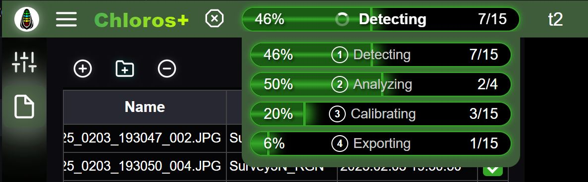
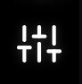

# GUI: Nawigacja

Po pierwszym uruchomieniu Chloros i Chloros (przeglądarka) uruchomi się jego zaplecze. Gdy będzie gotowe, w lewym górnym rogu pojawi się ikona menu głównego.  .

<figure><figcaption></figcaption></figure>

Od lewej do prawej górny nagłówek zawiera:

###  Menu główne

Z poziomu menu głównego można rozpocząć nowy projekt, otworzyć istniejący projekt lub otworzyć folder projektu.

###  Przycisk odtwarzania/startu

Po włączeniu przycisk startu przetwarzania uruchamia proces przetwarzania obrazu.

###  Pasek postępu W bezpłatnym trybie Chloros, który przetwarza wszystkie pliki sekwencyjnie, pasek postępu pokazuje 2 etapy: wykrywanie celu i przetwarzanie.

W płatnym trybie Chloros+ z licencją, który przetwarza wszystkie pliki jednocześnie, pasek postępu pokazuje 4 etapy: wykrywanie, analizowanie, kalibrowanie, eksportowanie. Po najechaniu kursorem myszy na pasek postępu Chloros+ rozwinie się rozszerzony panel z 4 paskami postępu, dzięki czemu można śledzić postępy. Kliknięcie górnego paska postępu spowoduje zamrożenie rozwijanego panelu, a ponowne kliknięcie spowoduje jego odblokowanie.

<figure><figcaption></figcaption></figure>

## Menu boczne

W menu bocznym po lewej stronie znajdują się różne ikony, które umożliwiają interakcję:

####  [Ustawienia projektu](project-settings/project-settings.md)

Zakładka Ustawienia projektu umożliwia dostosowanie globalnych ustawień projektu i ustawień przetwarzania projektu. Dostosuj je przed rozpoczęciem przetwarzania plików.

####  Przeglądarka plików

Dodawaj pliki/foldery i usuwaj pliki z projektu. Duplikaty plików są ignorowane. Zaznacz pole kolumny docelowej dla dowolnego obrazu docelowego, a przetwarzanie będzie dotyczyło tylko zaznaczonych obrazów docelowych, co znacznie przyspieszy czas przetwarzania. Użyj przełącznika Obraz/Metadane, aby przełączać się między wyświetlaniem siatki miniatur wybranych obrazów a szczegółową tabelą metadanych.

####  [Przeglądarka obrazów](image-viewer-gui/opening-an-image-full-screen.md)

Po kliknięciu obrazu w głównej przeglądarce obrazów zostanie on otwarty na pełnym ekranie w zakładce Przeglądarka obrazów.

####  [Mapa](image-viewer-gui/map-markers.md)

Wyświetlaj swoje obrazy na interaktywnej mapie 2D na podstawie ich współrzędnych GPS. Obsługuje dostawców kafelków Google Maps i ESRI, automatycznie wybierając najlepszą usługę dla Twojej lokalizacji. Najedź kursorem na znaczniki, aby wyświetlić podgląd miniatur obrazów.

####  Dziennik debugowania

Przejrzyj dziennik w poszukiwaniu wydruków debugowania, gdy wystąpią problemy. Skopiuj/pobierz dziennik i wyślij go do [MAPIR Support](https://www.mapir.camera/community/contact), aby uzyskać pomoc.

####  [Logowanie użytkownika](chloros+-login.md)

Pasek boczny logowania użytkownika umożliwia zalogowanie się na konto Chloros+ w celu odblokowania zaawansowanych funkcji. Można również wyświetlić aktualną wersję aplikacji, a także dostosować język wyświetlanego tekstu w interfejsie graficznym Chloros i CLI.
